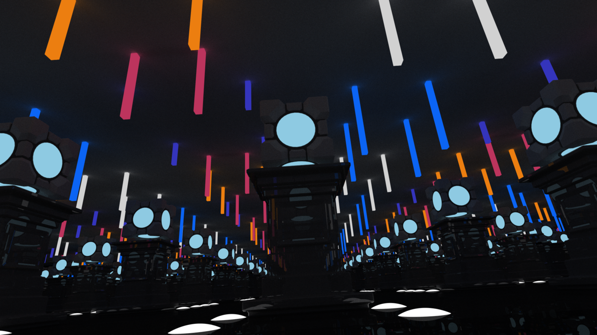
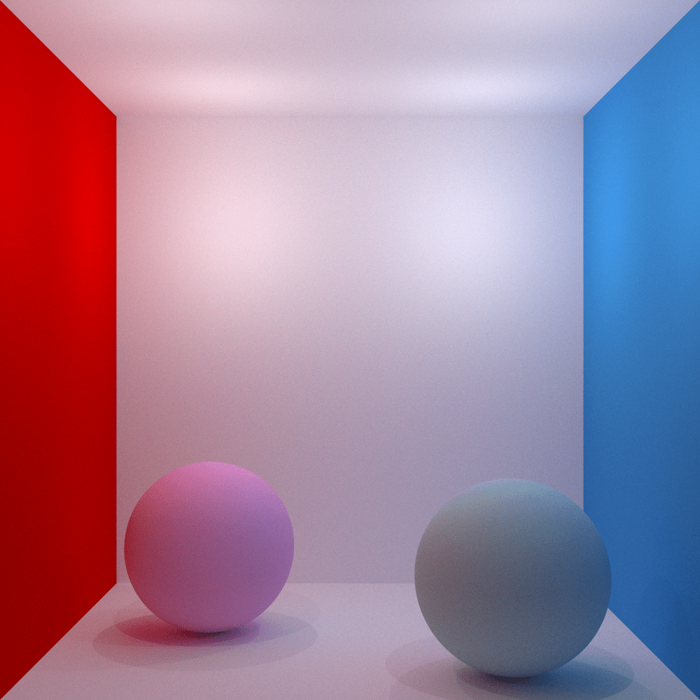
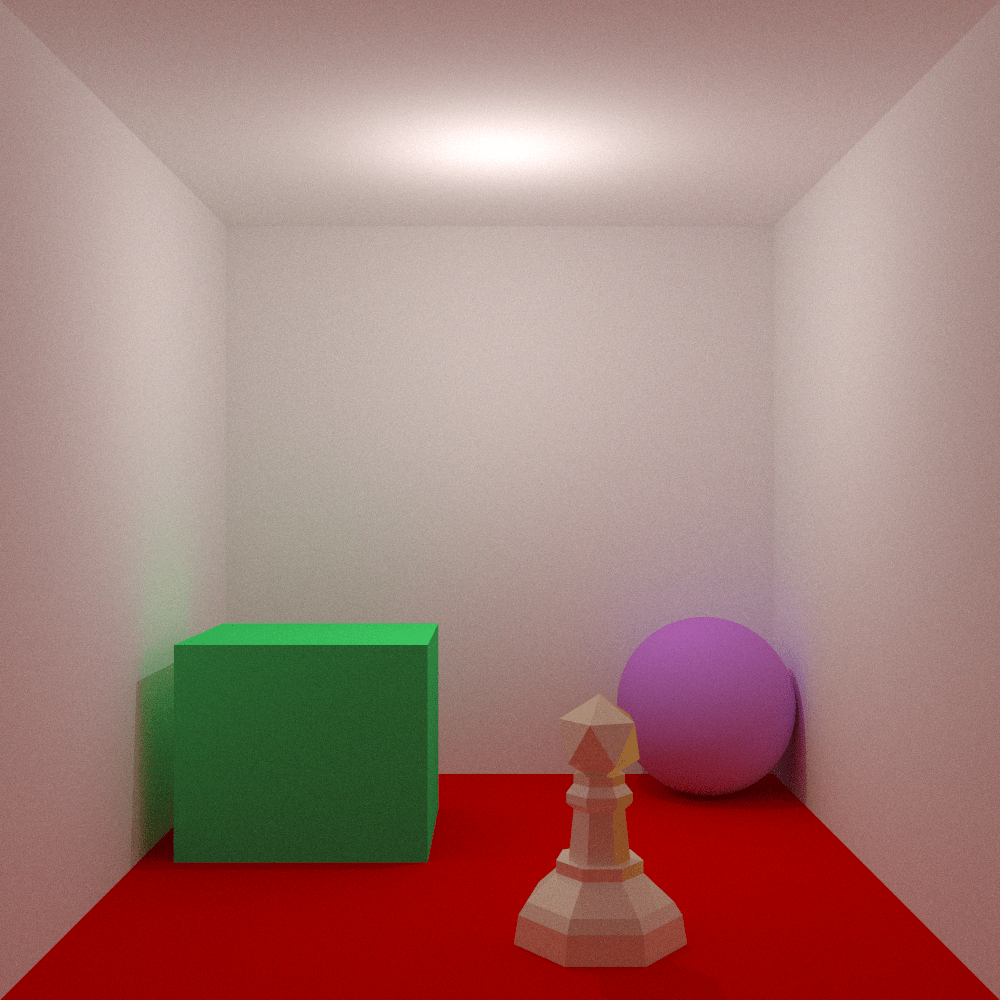
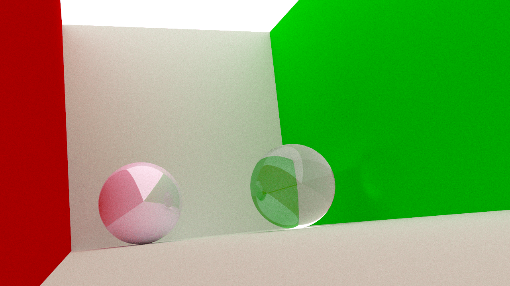
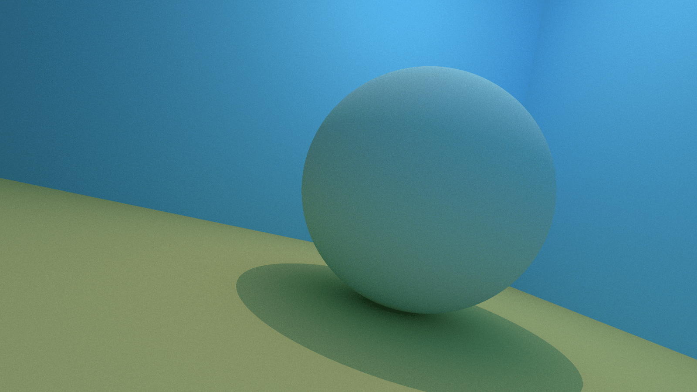
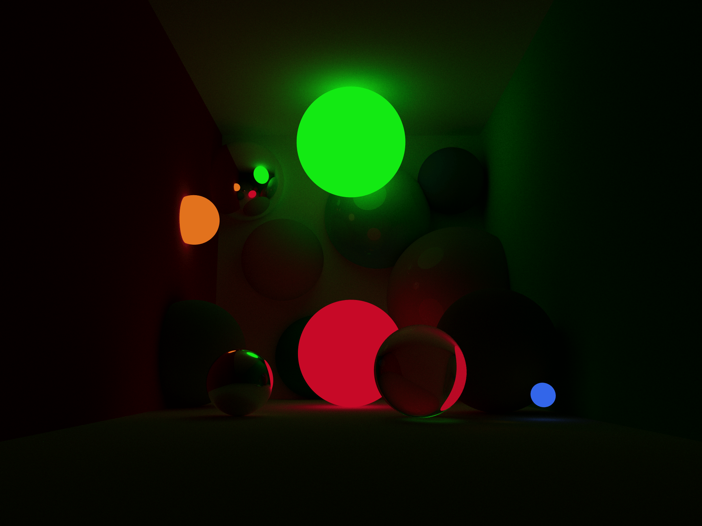

# Computer graphics
Computing Engineering Unizar 2022-23.

This a continue of a project based in a university assigment to implement a ray tracing from scratch.

<!--

-->

This project is licensed under the terms of the [GNU General Public License v3.0](https://www.gnu.org/licenses/gpl-3.0.en.html) (GPLv3). The GPLv3 is a license that guarantees the freedom to share, use, and modify the software, and requires that any derivative works are also distributed under the same terms. A copy of the license can be found in the [LICENSE](LICENSE) file.

  
  <em>Rendered in 64 hours and 39 minutes. 1920x1080 resolution.</em>
 

## Next moves
A list of the next moves in the project. Ordered in higher to lower priority:
- [ ] Objects:
  - [ ] Revise intersections methods.
  - [ ] New primitives:
    - [x] Circles.
    - [ ] Elipsoids.
    - [ ] (IN PROGRESS) Cones.
    - [ ] Plane polygons.
    - [ ] (IN PROGRESS) Cylindres.
    - [ ] Prisms.
    - [ ] Constructive solid geometry.
  - [ ] New material coefficients.
  - [ ] Texturization.
  - [ ] Normal mapping.
  - [ ] 3d meshes refactorization:
    - [ ] 3d meshes sets.
    - [ ] Operations.
    - [ ] Shading techniques.
    - [ ] Export 3d mesh.
- [ ] Cameras:
  - [ ] Depth of field.
  - [ ] Motion blur.
- [ ] Interactive UI:
  - [ ] A render visual program.
  - [ ] A new whole debug system.
- [ ] Debugger:
  - [ ] Add a periodically friendly reminder telling you how many time has passed. Maybe show it always.
- [ ] Performance techniques:
  - [ ] Graphics card execution refactorization.
  - [ ] Multithreading.
  - [ ] Bounding volume hierarchies.
  - [ ] Distributed threading.
- [ ] Participating media.
- [ ] Tone mapping:
  - [ ] Advanced tone mapping techniques.
  - [ ] Spectral rendering.
  - [ ] Bitmap export.

## **Scenes**

  

    
    
  

  
  
  

