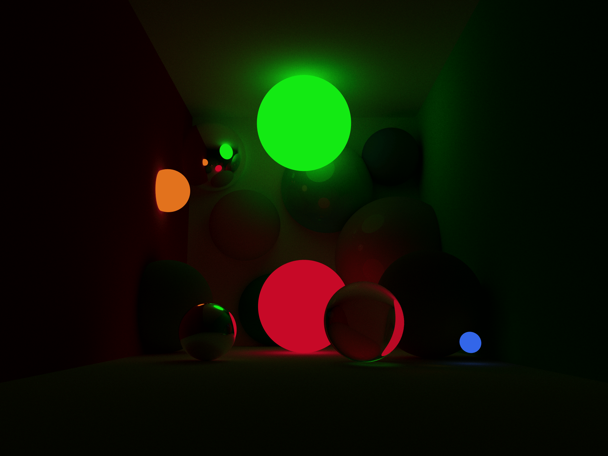

# Ingenieria informática
Informática gráfica Unizar 2022-23.

<!--

-->

Este proyecto está licenciado bajo los términos de la [Licencia Pública General de GNU versión 3](https://www.gnu.org/licenses/gpl-3.0.en.html) (GPLv3). La GPLv3 es una licencia que garantiza la libertad de compartir, usar y modificar el software, y requiere que cualquier obra derivada también se distribuya bajo los mismos términos. Una copia de la licencia se puede encontrar en el archivo [LICENSE](LICENSE).

  
  <em>Rendered in 64 hours and 39 minutes. 1920x1080 resolution.</em>
 

## Next moves
Una lista de los siguientes pasos que tengo pensados seguir. Supuestamente ordenados de mayor a menor prioridad:
- [ ] Objetos:
  - [ ] Revisar métodos de intersección.
  - [ ] Nuevas primitivas:
    - [x] Circulos.
    - [ ] Elipsoides.
    - [ ] (IN PROGRESS) Conos.
    - [ ] Poligonos planos.
    - [ ] (IN PROGRESS) Cilindros.
    - [ ] Prismas.
    - [ ] Geometría solida constructiva (CSG).
  - [ ] Nuevos coeficientes de materiales.
  - [ ] Texturizacion.
  - [ ] Mapas de normales.
  - [ ] Refactorizacion de las mallas 3d:
    - [ ] Conjuntos de mallas 3d.
    - [ ] Operaciones.
    - [ ] Tecnicas de shading.
    - [ ] Exportar mallas 3d.
- [ ] Camaras:
  - [ ] Profundidad de campo.
  - [ ] Motion blur.
- [ ] UI Interactiva:
  - [ ] Un programa de render visual.
  - [ ] Nuevo sistema de debug completo.
- [ ] Debugger:
  - [ ] Add a periodically friendly reminder telling you how many time has passed. Maybe show it always.
- [ ] Tecnicas de eficiencia:
  - [ ] Refactorizacion para ejecución sobre tarjetas gráficas.
  - [ ] Multihilado.
  - [ ] Bounding volume hierarchies.
  - [ ] Multihilado distribuido.
- [ ] Medios participativos.
- [ ] Filtros (tone mapping):
  - [ ] Tecnicas de tone mapping avanzadas.
  - [ ] Renderizacion espectral.
  - [ ] Exportar a bitmap.

## **Scenes**

  

    
    
  

  
  
  

