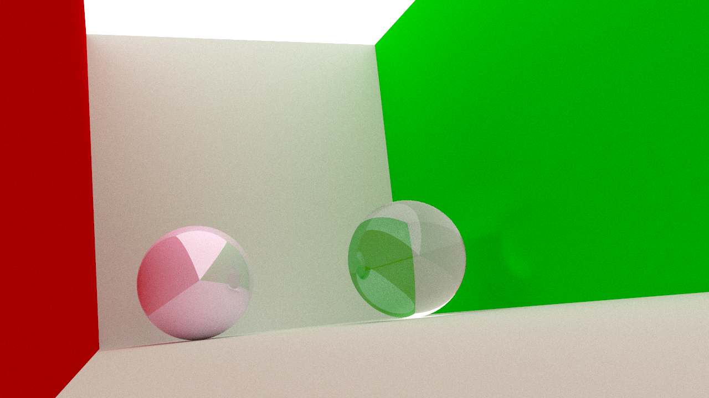

# Ingenieria informática
Informática gráfica Unizar 2022-23.

Este proyecto está licenciado bajo los términos de la [Licencia Pública General de GNU versión 3](https://www.gnu.org/licenses/gpl-3.0.en.html) (GPLv3). La GPLv3 es una licencia que garantiza la libertad de compartir, usar y modificar el software, y requiere que cualquier obra derivada también se distribuya bajo los mismos términos. Una copia de la licencia se puede encontrar en el archivo [LICENSE](LICENSE).

<!--

-->

---

# Escenas:

